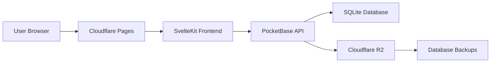

This page provides a comprehensive overview of the technology stack powering sptfy.in, including frameworks, libraries, and development tools.

## Architecture

sptfy.in uses a modern JAMstack architecture with a serverless frontend and a self-hosted backend:



## Frontend Stack

### SvelteKit

[SvelteKit](https://kit.svelte.dev/) is the full-stack framework built on Svelte, providing:

- File-based routing with `+page.svelte` files
- Server-side rendering (SSR) and static site generation (SSG)
- API routes via `+server.js` files
- Built-in form handling with progressive enhancement

**Adapter:** `@sveltejs/adapter-cloudflare` for Cloudflare Pages deployment

### Svelte 5 (Runes)

[Svelte 5](https://svelte.dev/) introduced **runes**, a new way to declare reactive state:

```svelte title="example.svelte"
<script>
	// Reactive state
	let count = $state(0);

	// Computed values
	let doubled = $derived(count * 2);

	// Props
	const { title, description } = $props();

	function increment() {
		count++;
	}
</script>

<button onclick={increment}>
	Clicks: {count} (doubled: {doubled})
</button>
```

<Warning>
**Do NOT use** `let` or `export let` for reactive variables. Always use `$state()`, `$derived()`, and `$props()` runes.
</Warning>

### UI Components

#### Shadcn-Svelte

[shadcn-svelte](https://shadcn-svelte.com/) provides beautifully designed, accessible components built on:

- **bits-ui** - Headless UI primitives
- **Tailwind CSS** - Utility-first CSS framework
- **tailwind-variants** - Component variants with type safety

Components are imported from `$lib/components/ui/`:

```svelte
import { Button } from '$lib/components/ui/button';
import { Dialog } from '$lib/components/ui/dialog';
```

#### Additional UI Libraries

- **lucide-svelte** - Icon library (e.g., `<iconify-icon icon="lucide:icon-name">`)
- **svelte-sonner** - Toast notifications
- **vaul-svelte** - Drawer/bottom sheet component
- **mode-watcher** - Dark mode support

### Styling

#### Tailwind CSS

[Tailwind CSS](https://tailwindcss.com/) v3.4+ with:

- **@tailwindcss/typography** - Beautiful typographic defaults
- **tailwind-merge** - Intelligent class merging
- **clsx** - Conditional class names

#### Fonts

**Plus Jakarta Sans** - Clean, modern sans-serif font family

### Forms & Validation

- **sveltekit-superforms** - Type-safe form handling with SvelteKit
- **formsnap** - Form state management
- **zod** - Schema validation

```svelte title="form-example.svelte"
<script>
	import { z } from 'zod';
	import { superForm } from 'sveltekit-superforms';

	const schema = z.object({
		slug: z.string().min(3).max(20),
		url: z.string().url()
	});

	const form = superForm(data.form, { validators: schema });
</script>
```

### Security

- **svelte-turnstile** - Cloudflare Turnstile CAPTCHA integration

## Backend Stack

### PocketBase

[PocketBase](https://pocketbase.io/) v0.23.12 - An open-source backend in a single binary:

- **Database:** Embedded SQLite with automatic migrations
- **Authentication:** OAuth2 (Spotify), email/password
- **API:** Auto-generated REST API with real-time subscriptions
- **Admin UI:** Web-based dashboard at `/_/`
- **File Storage:** Built-in file uploads
- **Hooks:** Server-side JavaScript hooks for custom logic

#### PocketBase Client

The frontend connects to PocketBase using the official JavaScript SDK:

```javascript title="src/lib/pocketbase.js"
import PocketBase from 'pocketbase';

export const pb = new PocketBase(import.meta.env.VITE_POCKETBASE_URL);
```

#### Collections

- **users** - User accounts (Spotify OAuth)
- **random_short** - Short link records
- **analytics** - Click tracking and geolocation

#### Hooks

Server-side hooks in `pocketbase/pb_hooks/`:

**`random.pb.js`:**
- Turnstile verification before creating links
- Field protection on updates
- Spotify user ID extraction on OAuth

**`main.pb.js`:**
- Custom API routes

### Database

**SQLite** - Lightweight, serverless database:

- Single-file database (`pb_data/data.db`)
- ACID-compliant transactions
- Automated backups to Cloudflare R2

## Development Tools

### Package Manager

**pnpm** - Fast, disk-space efficient package manager

<Note>
The project enforces pnpm usage via the `preinstall` script. npm and yarn will be rejected.
</Note>

### Build Tools

- **Vite** v6.3+ - Next-generation frontend build tool
- **vite-plugin-mkcert** - HTTPS for local development

### Code Quality

#### Linting

**ESLint** v9+ with:
- `eslint-plugin-svelte` - Svelte-specific rules
- `eslint-config-prettier` - Disable conflicting rules

```bash
pnpm lint
```

#### Formatting

**Prettier** v3.6+ with:
- `prettier-plugin-svelte` - Format `.svelte` files
- `prettier-plugin-tailwindcss` - Sort Tailwind classes

Configuration (`.prettierrc`):

```json
{
	"useTabs": true,
	"singleQuote": true,
	"trailingComma": "none",
	"printWidth": 100
}
```

```bash
pnpm format
```

### Testing

**Vitest** v3.1+ - Blazing fast unit testing framework

```bash
vitest
```

Tests are located in `src/lib/**tests**`.

### Version Control

- **Git** - Source control
- **GitHub** - Code hosting and CI/CD
- **beads** - Git-native issue tracking for AI agents

## Deployment

### Frontend Deployment

**Cloudflare Pages:**
- Automatic builds on push to `main`
- Global CDN with edge caching
- Instant rollbacks via dashboard
- Custom domain: `sptfy.in`

**Build command:** `pnpm build`  
**Output directory:** `build/`

### Backend Deployment

**VPS (Virtual Private Server):**
- **Docker** container with PocketBase
- **Nginx** reverse proxy (`127.0.0.1:8091`)
- **GitHub Actions** for automated deployment
- **Location:** `~/pb-docker/`

**Deployment triggers:**
- Push to `main` branch
- Changes to `pocketbase/pb_hooks/**`, `pocketbase/pb_migrations/**`, or `docker-compose.yml`

### Monitoring

- **BetterStack** - Status page and uptime monitoring
- **Public status page:** [status.sptfy.in](https://status.sptfy.in)

### Backups

- **Automated:** PocketBase built-in backup feature
- **Destination:** Cloudflare R2 (S3-compatible storage)
- **Frequency:** Configurable in PocketBase settings

## Key Dependencies

### Runtime Dependencies

```json
{
	"pocketbase": "^0.21.5",
	"svelte": "^5.38.0",
	"@sveltejs/kit": "^2.27.3",
	"bits-ui": "^1.8.0",
	"formsnap": "^1.0.1",
	"sveltekit-superforms": "^2.15.1",
	"zod": "^3.23.8",
	"nanoid": "^5.0.7",
	"svelte-sonner": "^0.3.27",
	"svelte-turnstile": "^0.7.1",
	"mode-watcher": "^0.3.1",
	"lucide-svelte": "^0.469.0",
	"iconify-icon": "^2.1.0",
	"tailwindcss": "^3.4.4",
	"clsx": "^2.1.1",
	"tailwind-merge": "^2.3.0",
	"tailwind-variants": "^0.2.1"
}
```

### Development Dependencies

```json
{
	"@sveltejs/adapter-cloudflare": "^7.1.3",
	"@sveltejs/vite-plugin-svelte": "^6.1.1",
	"vite": "^6.3.0",
	"vitest": "^3.1.2",
	"eslint": "^9.0.0",
	"prettier": "^3.6.2",
	"typescript": "latest"
}
```

## Scripts

Common npm scripts defined in `package.json`:

```bash
# Start development server (with hot reload)
pnpm dev

# Build for production
pnpm build

# Preview production build locally
pnpm preview

# Run linters (ESLint + Prettier)
pnpm lint

# Format code with Prettier
pnpm format
```

## Environment Variables

### Development (`.env.development`)

```env
VITE_DEBUG_MODE=false
VITE_CF_SECRET=1x0000000000000000000000000000000AA
VITE_CF_SITE_KEY=1x00000000000000000000AA
VITE_POCKETBASE_URL=http://127.0.0.1:8090
VITE_APP_URL=http://127.0.0.1:5173
```

### Production

Configured in Cloudflare Pages dashboard:

- `VITE_POCKETBASE_URL` - Production PocketBase URL
- `VITE_CF_SECRET` - Real Cloudflare Turnstile secret
- `VITE_CF_SITE_KEY` - Real Cloudflare Turnstile site key
- `VITE_APP_URL` - Production app URL

## File Naming Conventions

- **Components:** `kebab-case.svelte` (e.g., `user-profile.svelte`)
- **Routes:** `+page.svelte`, `+server.js`, `+layout.svelte`
- **Utilities:** `camelCase.js` (e.g., `formatDate.js`)
- **Types:** `PascalCase.ts` (e.g., `UserProfile.ts`)

## Code Style Guidelines

From `.prettierrc` and `AGENTS.md`:

- **Indentation:** Tabs (not spaces)
- **Quotes:** Single quotes (`'`)
- **Trailing commas:** None
- **Line width:** 100 characters
- **Svelte 5 patterns:** Always use runes (`$state`, `$derived`, `$props`)
- **Import order:** Framework imports first, then libraries, then local

## Next Steps

- Set up your [Local Development Environment](/development/local-setup)
- Read the [Contributing Guidelines](/development/contributing)
- Explore the [API Documentation](/api/authentication)
